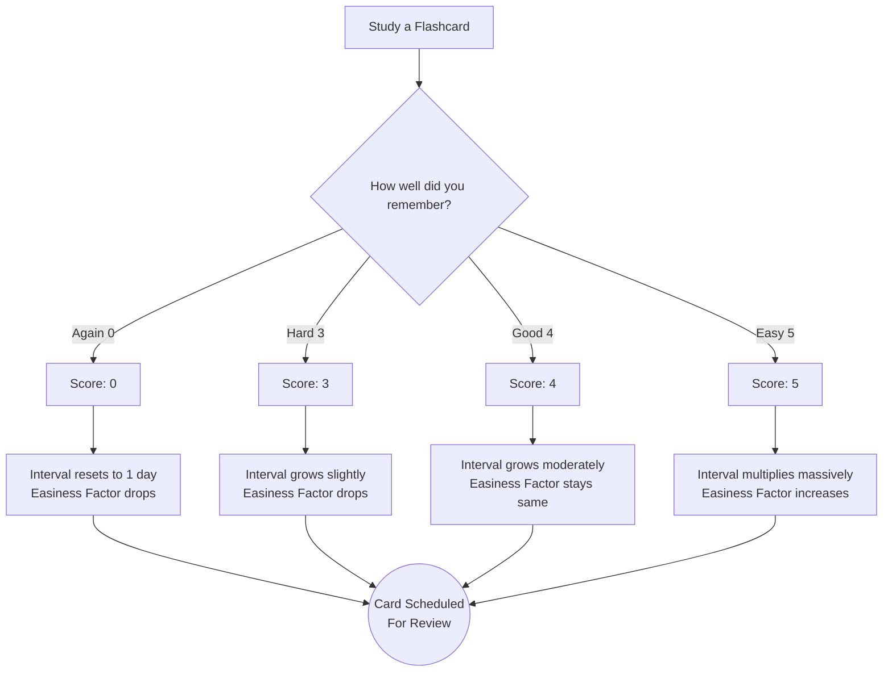

# SpacedRep

SpacedRep is a modern spaced repetition web application designed to make learning and memorization more efficient. It combines the proven SM-2 spaced repetition algorithm with AI to streamline the process of creating and reviewing flashcards.

## ✨ Core Features

- **AI Flashcard Generation**: Enter a topic, and the app uses Gemini AI to automatically generate a mixed-format quiz (Multiple Choice and Fill-in-the-Blanks). You can select which questions to keep and save them directly as a new deck.
- **SM-2 Algorithm Implementation**: Cards are scheduled for review based on the SuperMemo-2 algorithm to ensure you study concepts exactly when you are about to forget them.
- **Honest Review Metrics**: The app tracks how long you take to answer a card and whether you used an AI-generated hint. Taking longer than 15 seconds or using a hint dynamically limits your maximum score (preventing you from falsely rating a card as "Easy").
- **Dark Mode UI**: A clean, distraction-free interface built with Tailwind CSS.

## 🧠 Why SM-2? (The Science of Memory)

SpacedRep relies heavily on the **SM-2 (SuperMemo-2)** algorithm, widely considered one of the most mathematically effective methods for long-term memory retention.

### The Forgetting Curve
Human memory decays exponentially. If you learn something once, you will forget roughly 70% of it within a few days. **Spaced repetition flattens this curve** by forcing you to recall information just as you are about to forget it.

<p align="center">
  
  <br>
  <i>The Ebbinghaus Forgetting Curve: Each review (green line) resets memory retention to 100% and slows down the rate of future decay.</i>
</p>

### How SpacedRep's Algorithm Works

Instead of studying all flashcards every day, SM-2 schedules reviews based on your historical performance with each specific card. Every card has an **Easiness Factor (EF)** starting at 2.5.



**What makes SpacedRep different?** We added **Honest Review Constraints**:
- If you use an AI hint, the `Good` and `Easy` buttons are disabled.
- If you take longer than 15 seconds to answer, the `Easy` button is disabled. 
- This forces the SM-2 algorithm to give you mathematically honest intervals, preventing you from faking mastery.

## 🛠️ Tech Stack

- **Frontend**: React 19, Vite, Tailwind CSS
- **Backend & Database**: Firebase (Firestore, Authentication)
- **Serverless Functions**: Firebase Cloud Functions (Node.js)
- **AI Integration**: Google Gemini 3.6 Flash API

## 🚀 Running Locally

1. **Clone the repository**
   ```bash
   git clone https://github.com/dhanunjay1729/spaced-repetition-app.git
   cd spaced-repetition-app
   ```

2. **Install dependencies**
   ```bash
   npm install
   ```

3. **Set up Firebase**
   Create a `.env` file in the root directory and add your Firebase config:
   ```env
   VITE_FIREBASE_API_KEY=your_api_key
   VITE_FIREBASE_AUTH_DOMAIN=your_auth_domain
   VITE_FIREBASE_PROJECT_ID=your_project_id
   VITE_FIREBASE_STORAGE_BUCKET=your_storage_bucket
   VITE_FIREBASE_MESSAGING_SENDER_ID=your_messaging_sender_id
   VITE_FIREBASE_APP_ID=your_app_id
   ```

4. **Start the development server**
   ```bash
   npm run dev
   ```

## 📄 License

This project is open-source and available under the MIT License.
